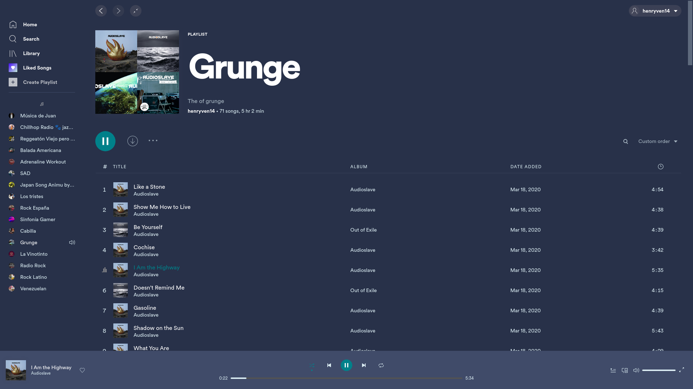
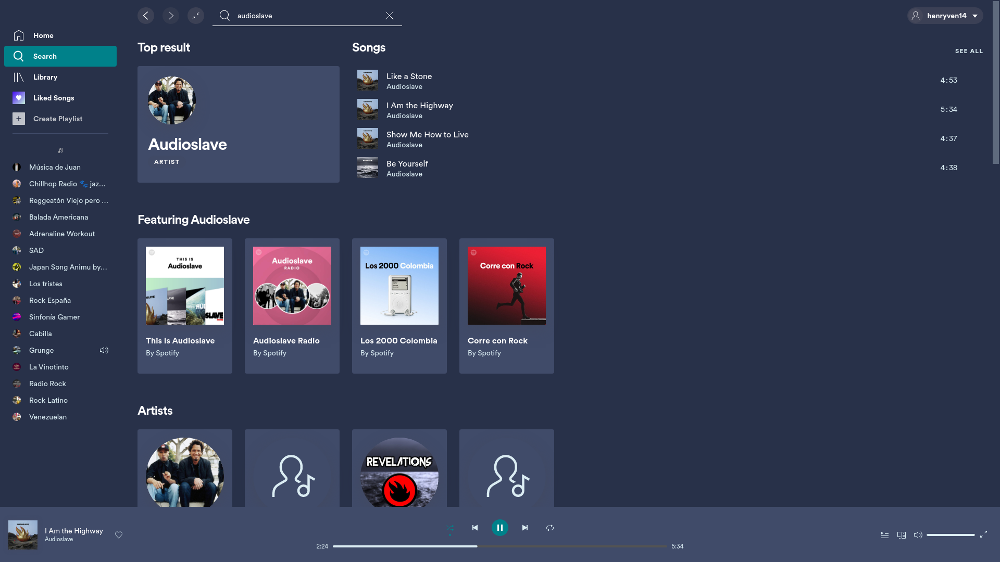

# Hvg

### Screen 1

### Screen 2

### Screen 3

### Screen 4


## Info
A simple and 'Hvg' theme that builds on the basic Spotify user interface to create a more elegant experience and is compatible with the latest version of spotify

Created by [@henryVentura14](https://github.com/henryVentura14)

### Changing Color Schemes
Change the scheme with these commands:
```
spicetify config current_theme Hvg color_scheme Hvg
spicetify apply
spicetify update
```